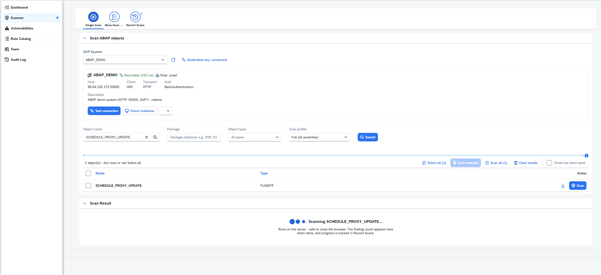
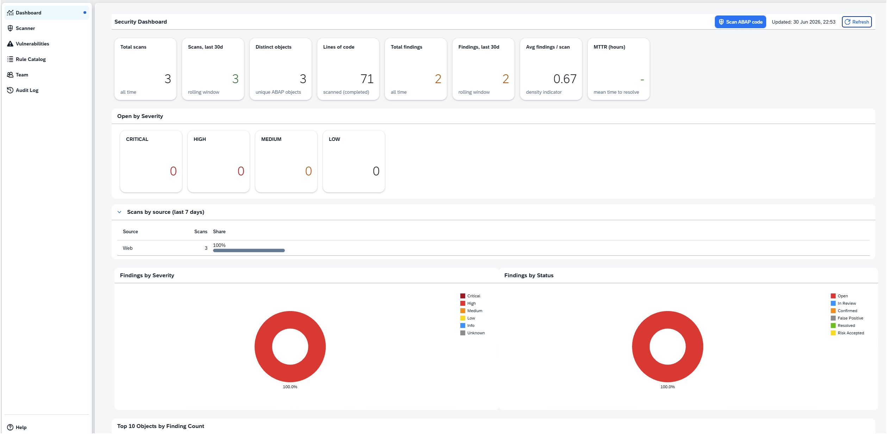
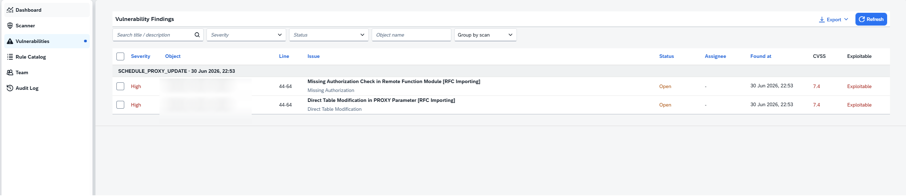
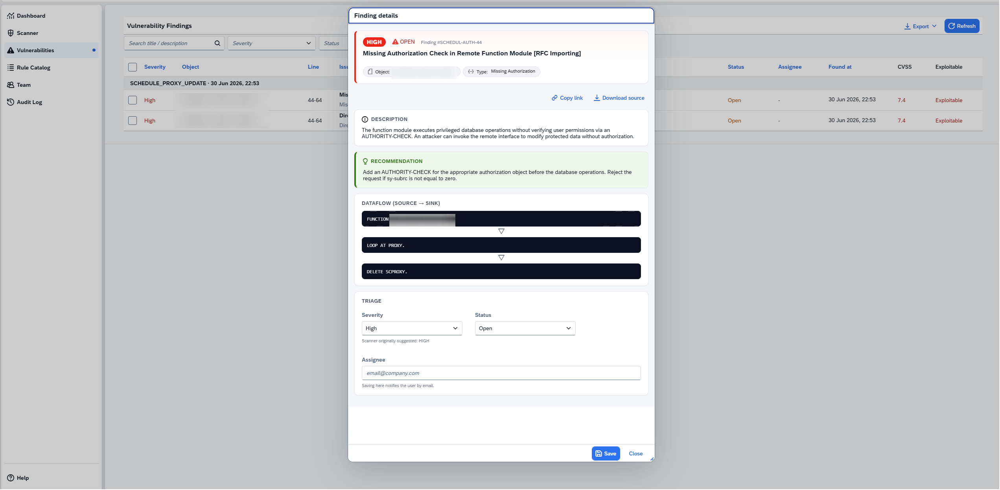
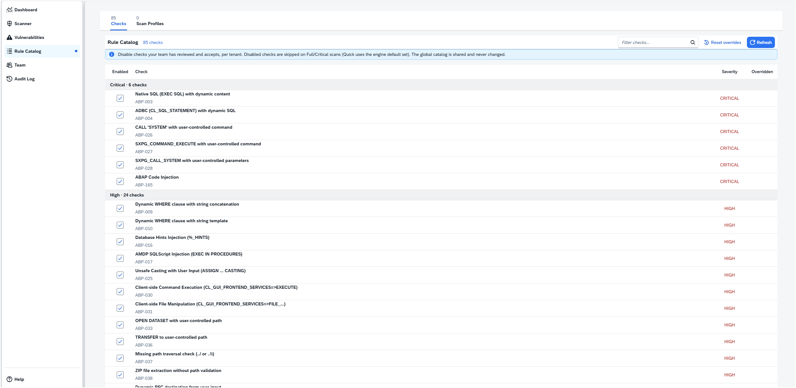
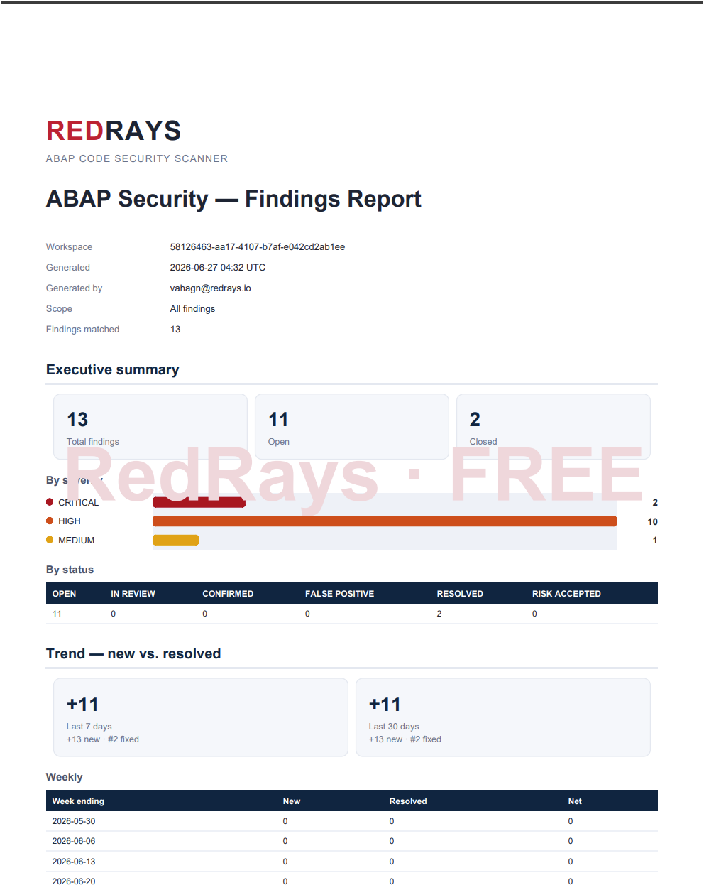

# ABAP Code Scanner - Cloud Edition for SAP BTP

> The free [open-source CLI](index.md) scans **exported** ABAP source offline.
> The **Cloud Edition** is a commercial, multi-tenant SaaS by [RedRays](https://redrays.io/) that runs
> natively on **SAP BTP** and connects directly to your SAP systems - no manual export needed. It builds
> on the same open-source check engine and adds an 85-check configurable rule catalog, a web UI, dashboards and reporting.
> The OWASP project itself remains free and open source.

<!-- SCREENSHOT 1 -> assets/images/btp/01-scan.png
     Capture: the Scanner tab / scan-launch panel - target (destination) selection,
     scan options and the filter bar. Light theme, no real hostnames/tokens visible. -->

## How it differs from the open-source CLI

| | Open-source CLI | Cloud Edition (SAP BTP) |
|---|---|---|
| Delivery | Python CLI you run locally | Multi-tenant SaaS on SAP BTP |
| Source input | Exported ABAP files | Live read over BTP Destinations (ADT), inline (Eclipse plugin / gCTS export), or files |
| Rule set | Core security checks | Configurable rule catalog - 85 checks, enable / disable / override per project |
| Output | XLSX report | Web dashboard, CVSS + exploitability fact-check, PDF & Excel, trend reports |
| Scope | One folder at a time | Many objects or whole systems |
| Connectivity | n/a | Internet and on-prem via SAP Cloud Connector; RISE private edition (PCE) |
| Access control | n/a | Per-tenant isolation, SSO via corporate IdP, role collections |

## Key capabilities

- **Connects to your SAP systems** over BTP Destinations (ADT) - classic on-premise ABAP (Internet or SAP Cloud Connector) and RISE private edition - or ingests source inline from the Eclipse plugin or a gCTS / abapGit export. Self-signed lab systems are supported.
- **Multi-pass scan engine** by severity. Every finding carries a **CVSS score and vector** plus an **automated exploitability fact-check** to cut false positives.
- **Security dashboard** with severity and status breakdowns, top vulnerable objects, top issue types, and a new-vs-resolved trend.
- **Configurable rule catalog** - 85 checks across four severity levels; enable, disable or override each rule per project.
- **Reporting**: one-click PDF and Excel findings reports.
- **Enterprise-ready**: per-tenant data isolation, single sign-on via your corporate identity provider, and email / alert notifications on finding assignment.

<!-- SCREENSHOT 2 -> assets/images/btp/02-dashboard.png
     Capture: the Analytics / Dashboard tab WITH data - severity chart, status,
     top-10 objects / issue types, KPI tiles. Use a populated tenant, not the empty state. -->

## Findings and triage

Each finding shows the affected object and line, a description, severity, CVSS, the exploitability
verdict, status, and an assignee. Triage from the browser; assignees are notified by email.

<!-- SCREENSHOT 3 -> assets/images/btp/03-findings.png
     Capture: the Vulnerabilities / Findings table - columns for severity, CVSS, status, object. -->

<!-- SCREENSHOT 4 -> assets/images/btp/04-finding-detail.png
     Capture: a single finding opened - description, CVSS vector, exploitability fact-check,
     code location / snippet, remediation guidance. -->

## Rule catalog

The scanner runs a catalog of **85 built-in checks** across four severity levels. In the web UI each rule can be **enabled, disabled or overridden** per project, so the policy fits your code base.

| Severity | Checks |
|---|---|
| Critical | 6 |
| High | 24 |
| Medium | 43 |
| Low | 12 |
| **Total** | **85** |

<!-- SCREENSHOT 5 -> assets/images/btp/05-rule-catalog.png
     Capture: the Rule Catalog UI - rules grouped by severity with the Enabled / Override toggles. -->

### Critical (6)

| ID | Check |
|---|---|
| ABP-003 | Native SQL (`EXEC SQL`) with dynamic content |
| ABP-004 | ADBC (`CL_SQL_STATEMENT`) with dynamic SQL |
| ABP-026 | `CALL 'SYSTEM'` with user-controlled command |
| ABP-027 | `SXPG_COMMAND_EXECUTE` with user-controlled command |
| ABP-028 | `SXPG_CALL_SYSTEM` with user-controlled parameters |
| ABP-165 | ABAP code injection |

### High (24)

| ID | Check |
|---|---|
| ABP-009 | Dynamic `WHERE` clause with string concatenation |
| ABP-010 | Dynamic `WHERE` clause with string template |
| ABP-016 | Database hints injection (`%_HINTS`) |
| ABP-017 | AMDP SQLScript injection (`EXEC` in procedures) |
| ABP-025 | Unsafe casting with user input (`ASSIGN ... CASTING`) |
| ABP-030 | Client-side command execution (`CL_GUI_FRONTEND_SERVICES=>EXECUTE`) |
| ABP-031 | Client-side file manipulation (`CL_GUI_FRONTEND_SERVICES=>FILE_...`) |
| ABP-033 | `OPEN DATASET` with user-controlled path |
| ABP-036 | `TRANSFER` to user-controlled path |
| ABP-037 | Missing path-traversal check (`../` or `..\`) |
| ABP-038 | ZIP file extraction without path validation |
| ABP-042 | Dynamic RFC destination from user input |
| ABP-043 | Dynamic RFC destination without whitelist |
| ABP-044 | RFC trusted-relationship abuse (`DESTINATION 'TRUSTED'`) |
| ABP-045 | `RFC DESTINATION 'NONE'` for authorization bypass |
| ABP-048 | Trusted RFC connection misuse |
| ABP-049 | RFC callback without source validation |
| ABP-092 | Ignored `SY-SUBRC` after `AUTHORITY-CHECK` |
| ABP-095 | Weak authority check (`FIELD 'ACTVT' VALUE 'DUMMY'`) |
| ABP-106 | Job submission with identity spoofing (`JOB_SUBMIT ... USER`) |
| ABP-113 | Direct update of standard tables (`MARA`, `VBAK`, `EKKO`) |
| ABP-114 | Direct table modification bypassing application logic |
| ABP-126 | Hardcoded password in source code |
| ABP-AUTH | Missing authority check |

### Medium (43)

| ID | Check |
|---|---|
| ABP-001 | Internal kernel call (`SYSTEM-CALL`) |
| ABP-002 | Direct kernel function call (`CALL 'C_...'`) |
| ABP-013 | Dynamic `ORDER BY` clause |
| ABP-029 | OS command injection via pipe (`OPEN DATASET ... FILTER`) |
| ABP-032 | SAP shortcut injection (generating `.sap` files) |
| ABP-039 | `FILE_GET_NAME` with user-controlled logical filename |
| ABP-041 | ArchiveLink path traversal (`ARCHIVFILE_SERVER_TO_CLIENT`) |
| ABP-046 | RFC function without caller validation |
| ABP-050 | HTTP client with user-controlled URL |
| ABP-051 | Missing whitelist for HTTP hosts |
| ABP-054 | LDAP injection (`CL_LDAP_CLIENT`) |
| ABP-055 | HTTP connection instead of HTTPS |
| ABP-056 | SSL certificate validation disabled |
| ABP-057 | BSP output without HTML escaping |
| ABP-060 | BSP form field without input validation |
| ABP-062 | ICF handler response without escaping |
| ABP-063 | Web Dynpro `FormattedTextView` with unescaped content |
| ABP-066 | WD action handler without input validation |
| ABP-067 | WD context manipulation without validation |
| ABP-068 | Cross-Site Request Forgery (CSRF) in handlers |
| ABP-069 | JSON Web Token (JWT) weakness (`CL_SXML_...`) |
| ABP-070 | Missing `CL_ABAP_DYN_PRG=>ESCAPE_XSS_HTML` usage |
| ABP-073 | HTTP header with user-controlled value (CRLF injection) |
| ABP-074 | HTML email body with user-controlled content |
| ABP-075 | Email content injection (`CL_BCS` with user input) |
| ABP-093 | Missing `ACTVT` field in `AUTHORITY-CHECK` |
| ABP-096 | Weak authority check (`FIELD ... VALUE '*'`) |
| ABP-097 | Backdoor via hardcoded username check |
| ABP-099 | Backdoor via system ID check (`SY-SYSID`) |
| ABP-101 | Backdoor via date / time check |
| ABP-109 | Denial of service via `WAIT` (`WAIT UP TO ... SECONDS`) |
| ABP-118 | Cross-client data modification (`UPDATE` / `DELETE`) |
| ABP-121 | Hardcoded client / mandant number |
| ABP-122 | Bypassing transaction management (`CL_OS_TRANSACTION`) |
| ABP-137 | Debug statements in production code (`BREAK-POINT`) |
| ABP-139 | Sensitive data in RFC export parameters without auth check |
| ABP-140 | Weak hash algorithm (MD5 / SHA1) for passwords |
| ABP-141 | Weak random number generation |
| ABP-144 | `IMPORT FROM DATABASE` with user-controlled key |
| ABP-145 | Unsafe memory ID (`EXPORT ... TO MEMORY ID`) |
| ABP-147 | `CALL TRANSFORMATION` with external XML |
| ABP-148 | XML parsing without DTD disabled |
| ABP-154 | Missing validation of dynamic table / field names against the dictionary |

### Low (12)

| ID | Check |
|---|---|
| ABP-008 | Editor-call for report modification |
| ABP-053 | Missing validation of internal IP addresses |
| ABP-105 | Logic bypass via user memory (`GET PARAMETER ID`) |
| ABP-129 | Password / secret in log output (`MESSAGE`, `WRITE`) |
| ABP-132 | Log injection via user input in messages |
| ABP-133 | Missing Security Audit Log for sensitive operations |
| ABP-135 | Exception text exposed to end user |
| ABP-143 | `IMPORT FROM DATA BUFFER` with external data |
| ABP-146 | Shared memory read without validation |
| ABP-150 | JSON deserialization to dynamic type (`REF TO data`) |
| ABP-157 | `DO` loop with user-controlled counter |
| ABP-158 | `FIND REGEX` with user-controlled pattern |

## Reporting

Export findings to a formatted PDF or an Excel workbook for distribution and audit, and track how the
backlog moves over time with the new-vs-resolved trend.

<!-- SCREENSHOT 6 -> assets/images/btp/06-report.png
     Capture: a generated PDF or Excel findings report (or the report-generation dialog). -->

## Get access

The Cloud Edition is a commercial product. To request a demo or a trial, visit
[redrays.io/abap-scanner](https://redrays.io/abap-scanner/) or contact `support@redrays.io`.
