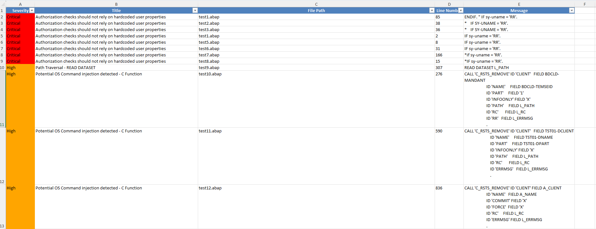

[](https://owasp.org/projects/)
[](https://github.com/OWASP/abap-code-scanner/blob/main/LICENSE)
[](https://www.python.org/)
[](https://github.com/OWASP/abap-code-scanner)

## SAST for SAP ABAP

SAP systems run on enormous amounts of custom **ABAP** (Advanced Business Application Programming) code that drives payroll, finance, logistics and other business-critical processes. That custom code is rarely security-reviewed and is a common source of injection, path-traversal and hard-coded-secret vulnerabilities.

The **OWASP ABAP Code Scanner** is a **Static Application Security Testing (SAST)** tool for ABAP. The open-source command-line scanner is the heart of this OWASP project: it statically analyses **exported** ABAP source **offline**, needs no connection to your SAP system, and drops straight into a CI/CD pipeline.

## Editions

| Edition | What it is | Where |
|---|---|---|
| **Open-source CLI** (free, MIT) | Scan exported ABAP source locally or in CI | This page (below) |
| **Cloud Edition (SAP BTP)** | Commercial SaaS that reads ABAP over BTP destinations | [Cloud / BTP edition »](btp-edition.md) |
| **Web (Management Console)** | Commercial web SAST that connects to SAP via SAP JCo / RFC | [Web edition »](web-edition.md) |

All three share the same scanning heritage. The commercial editions are by [RedRays](https://redrays.io/); the OWASP project itself is, and remains, free and open source.

## Why use the open-source CLI

- **Offline and agentless** - scan exported ABAP source on any machine; nothing is sent anywhere.
- **CI/CD ready** - a simple CLI you can gate your pipeline on.
- **Extensible** - add your own checks in a few lines of Python.
- **Actionable reports** - findings exported to XLSX for triage.
- **Free and open** - MIT-licensed and community-driven.

## Security checks

The scanner ships with checks for common ABAP security issues, including:

| Category | Examples |
|---|---|
| Injection | Cross-Site Scripting (XSS), SQL injection, directory traversal |
| Secrets | Hard-coded credentials and keys |
| Cryptography | Weak or outdated cryptographic algorithms |
| Best practices | Insecure dynamic statements, and more |

Checks are selected per run from a YAML config file, so you can tune the rule set to your code base.

## Quick start

```bash
# 1. Get the tool (Python 3.9+)
git clone https://github.com/OWASP/abap-code-scanner.git
cd abap-code-scanner
pip install -r requirements.txt

# 2. Scan a folder of ABAP source
python main.py path/to/abap/source
```

The scan writes `abap_security_scan_report.xlsx` to the project folder:



Full configuration, writing custom checks and running the tests are documented in the [README](https://github.com/OWASP/abap-code-scanner#readme).

## Roadmap

- **Data-flow (taint) analysis** - track tainted inputs from sources to sensitive sinks to reduce false positives and catch context-dependent vulnerabilities that simple pattern matching misses.
- **SARIF output** so findings show up natively in GitHub code scanning.
- More checks mapped to the OWASP Top 10 and SAP secure-coding guidance.

Contributions to any of these are very welcome.

## Getting involved

You do not need to be a security expert to help:

- Star and share the project.
- [Open an issue](https://github.com/OWASP/abap-code-scanner/issues) for a bug, a false positive, or a new check idea.
- Send a pull request - new checks, test cases and docs are all valuable.
- Say hello on the [OWASP Slack](https://owasp.org/slack/invite).

See [CONTRIBUTING.md](https://github.com/OWASP/abap-code-scanner/blob/main/CONTRIBUTING.md) to get started.

## Licensing

The OWASP ABAP Code Scanner is free to use and is released under the [MIT License](https://github.com/OWASP/abap-code-scanner/blob/main/LICENSE).

The project was originally contributed and is maintained by [RedRays](https://redrays.io/). Commercial [Cloud (SAP BTP)](btp-edition.md) and [Web (Management Console)](web-edition.md) editions are available separately; the OWASP project is, and remains, free and open source.
