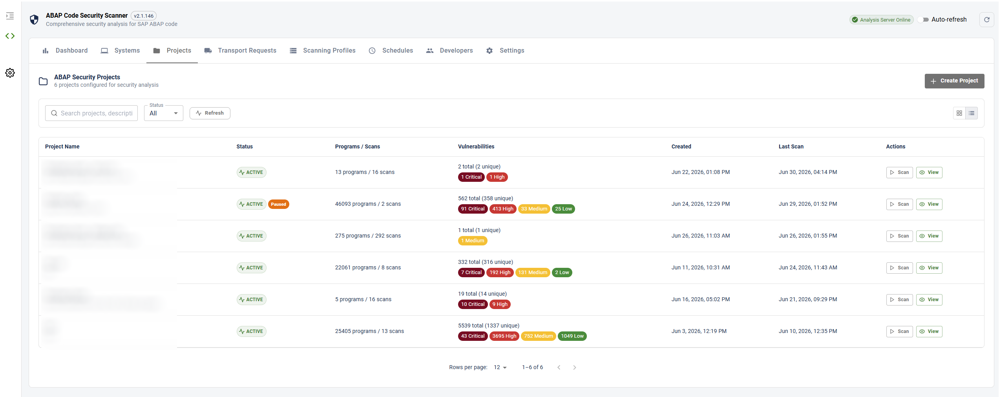
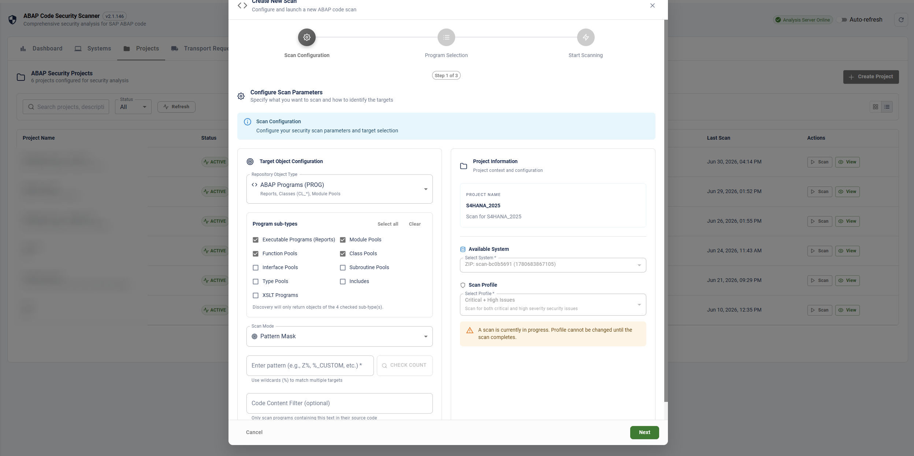
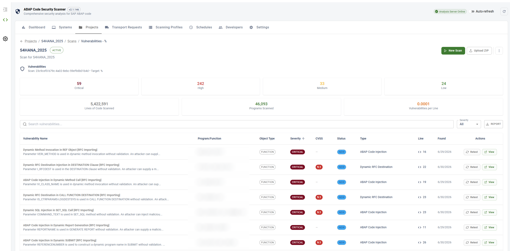
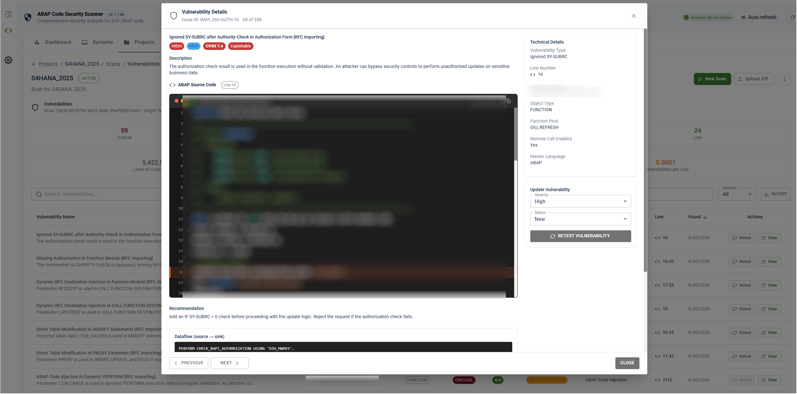
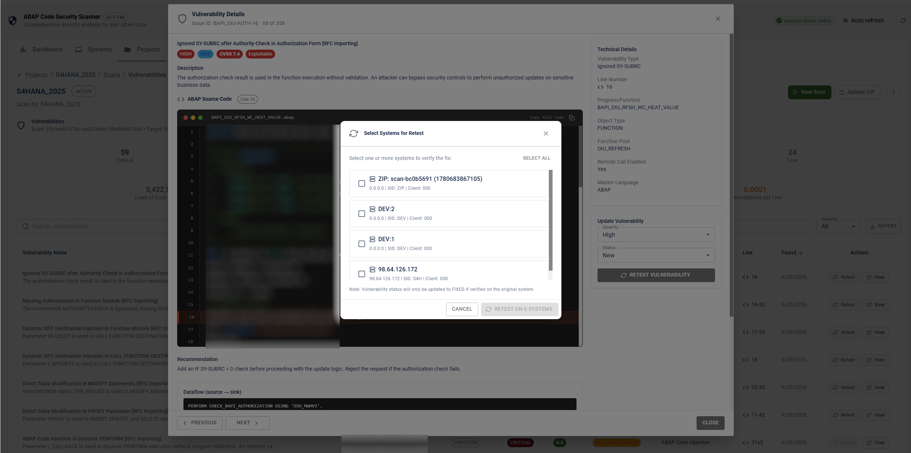
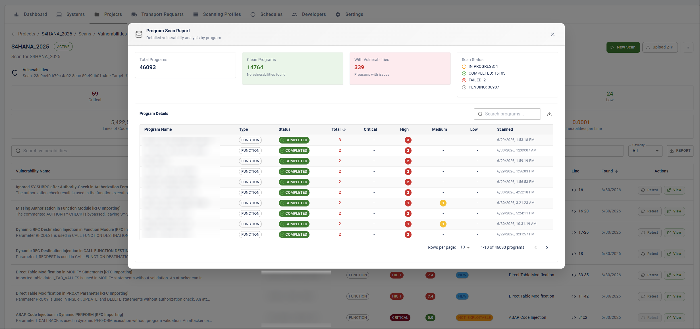

# ABAP Code Scanner - Web Edition (Management Console)

> The free [open-source CLI](index.md) scans **exported** ABAP source offline.
> The **Web Edition** is a commercial web application by [RedRays](https://redrays.io/) that
> **connects directly to your SAP systems over SAP JCo (RFC)** and statically analyses ABAP in place,
> presenting findings in a modern web UI. The OWASP project itself remains free and open source.

<!-- SCREENSHOT 1 -> assets/images/mc/01-projects.png
     Capture: the ABAP Code Security page - projects list with per-project vulnerability counts. -->

## What it does

- **Direct SAP connection (SAP JCo / RFC)** - scan ABAP straight from the system; no manual export.
- **Projects** - organise scans by mapping target **systems** to **scan profiles** (for example *OWASP Top 10* or *Critical issues only*).
- **Scheduled scans** - run recurring scans automatically.
- **Vulnerability dashboard** - findings ranked by **severity** and **CVSS**, each with a **confidence score** and a plain-language **explanation**.
- **Cross-system retest** - re-verify a finding across systems, with full retest history.
- **Reports & export** - export findings for triage and audit.
- **Enterprise access** - single sign-on and role-based access control.

<!-- SCREENSHOT 2 -> assets/images/mc/02-run-scan.png
     Capture: creating a project / starting a scan - selecting target system(s) and a scan profile. -->

## Findings and triage

Each finding identifies the affected ABAP object and location, with a severity, a CVSS score, a confidence score and a plain-language explanation, plus a status you manage from the browser.

<!-- SCREENSHOT 3 -> assets/images/mc/03-vulnerabilities.png
     Capture: the vulnerabilities table - severity, CVSS, status and object columns. -->

<!-- SCREENSHOT 4 -> assets/images/mc/04-finding-detail.png
     Capture: a single finding opened - description, severity/CVSS, confidence + explanation, code location, remediation. -->

## Retest across systems

Re-run a specific finding against one or more systems to confirm whether it is still present, and keep a history of every retest.

<!-- SCREENSHOT 5 -> assets/images/mc/05-retest.png
     Capture: the cross-system retest dialog and/or the retest history table. -->

## Reporting

Export findings to a report for distribution and audit.

<!-- SCREENSHOT 6 -> assets/images/mc/06-report.png
     Capture: an exported report, or the export dialog / scheduled-scans view. -->

## Get access

The Web Edition is a commercial product by [RedRays](https://redrays.io/). To request a demo or a trial, visit [redrays.io/abap-scanner](https://redrays.io/abap-scanner/) or contact `support@redrays.io`.
